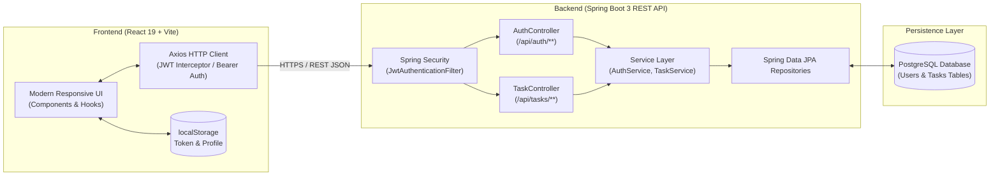
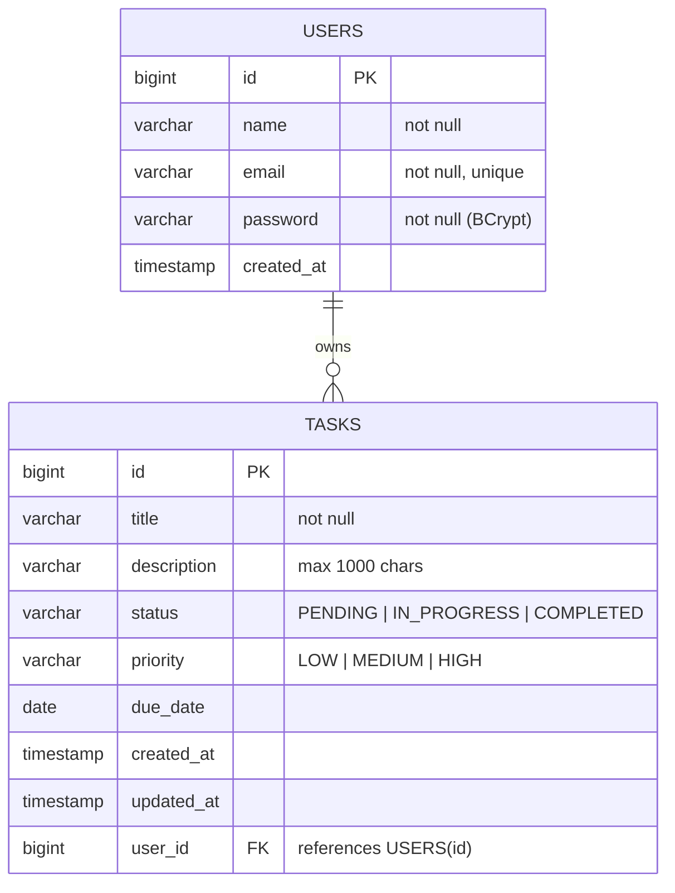

# 🚀 TaskFlow — Full-Stack Task Management System

[](https://spring.io/projects/spring-boot)
[](https://www.oracle.com/java/)
[](https://react.dev/)
[](https://vitejs.dev/)
[](https://www.postgresql.org/)
[](https://jwt.io/)
[](https://www.docker.com/)

**TaskFlow** is a modern, enterprise-ready full-stack task management application engineered with **Spring Boot 3** on the backend and **React 19 + Vite** on the frontend. It features secure stateless **JWT authentication**, **multi-tenant user data isolation**, dynamic productivity metrics, and an intuitive dashboard for managing, tracking, and completing daily workflows.

---

## 📑 Table of Contents

- [Key Features](#-key-features)
- [System Architecture](#-system-architecture)
- [Tech Stack](#-tech-stack)
- [Database Schema](#-database-schema)
- [API Reference](#-api-reference)
- [Project Directory Structure](#-project-directory-structure)
- [Environment Variables](#-environment-variables)
- [Getting Started](#-getting-started)
  - [Prerequisites](#prerequisites)
  - [Backend Setup (Spring Boot)](#1-backend-setup-spring-boot)
  - [Frontend Setup (React + Vite)](#2-frontend-setup-react--vite)
- [Docker Deployment](#-docker-deployment)
- [API Testing](#-api-testing)
- [Security & Best Practices](#-security--best-practices)
- [Roadmap & Enhancements](#-roadmap--enhancements)
- [License](#-license)

---

## ✨ Key Features

- **🔐 Robust JWT Authentication**: Stateless security using BCrypt password encryption and JSON Web Tokens (24h validity).
- **👤 User-Isolated Workspaces**: Every user has complete data privacy; tasks are strictly associated with and accessible by their creator.
- **📋 Complete Task Lifecycle**: Create, view, update, prioritize, mark as completed, and delete tasks seamlessly.
- **📊 Real-Time Metrics & Statistics**: Interactive counter cards showing **Total Tasks**, **Pending Tasks**, and **Completed Tasks**.
- **🎯 Multi-Criteria Filtering & Live Search**:
  - Instant client-side search by title or description.
  - Filter tasks by **Status** (`PENDING`, `IN_PROGRESS`, `COMPLETED`).
  - Filter tasks by **Priority** (`LOW`, `MEDIUM`, `HIGH`).
  - One-click filter reset.
- **⚡ Intuitive Inline Editor**: Smooth edit flow that pre-populates task details into the form with effortless cancellation.
- **🐳 Multi-Stage Docker Build**: Production-optimized, minimal footprint containerization using Eclipse Temurin JRE.
- **🌐 Production CORS Configuration**: Pre-configured support for local development (`localhost:5173`) and cloud deployments (`*.onrender.com`).

---

## 🏛 System Architecture



---

## 🛠 Tech Stack

### Backend
| Technology | Description |
| :--- | :--- |
| **Java 17 / 21** | Modern, high-performance LTS Java runtime |
| **Spring Boot 3.5.x** | Enterprise framework for web services and inversion of control |
| **Spring Security 6** | Comprehensive authentication and role-based access security |
| **Spring Data JPA** | Object-Relational Mapping (Hibernate) abstraction |
| **PostgreSQL** | Relational SQL database for secure, transactional persistence |
| **JJWT 0.12.6** | Java JWT library for signing and validating HS256 tokens |
| **Lombok** | Boilerplate reduction for Java models and constructors |
| **Maven** | Dependency management and build lifecycle orchestration |

### Frontend
| Technology | Description |
| :--- | :--- |
| **React 19.x** | Component-driven UI library with modern compiler support |
| **Vite 8.x** | High-speed build tool and hot-module replacement (HMR) dev server |
| **Axios** | Promise-based HTTP client with request headers management |
| **Vanilla CSS3** | Custom responsive styling, CSS grid, card elevations & badge system |

---

## 🗄 Database Schema



---

## 🔌 API Reference

### 1. Authentication Endpoints (`/api/auth`)

| Method | Endpoint | Access | Description |
| :--- | :--- | :--- | :--- |
| `POST` | `/api/auth/register` | Public | Register a new user account |
| `POST` | `/api/auth/login` | Public | Authenticate credentials and receive JWT |

#### Register Request Body:
```json
{
  "name": "Jane Doe",
  "email": "jane@example.com",
  "password": "securepassword123"
}
```

#### Successful Auth Response (`200 OK`):
```json
{
  "token": "eyJhbGciOiJIUzI1NiJ9...",
  "name": "Jane Doe",
  "email": "jane@example.com"
}
```

---

### 2. Task Management Endpoints (`/api/tasks`)
> **Note:** All task endpoints require the HTTP Header: `Authorization: Bearer <your_jwt_token>`

| Method | Endpoint | Access | Description |
| :--- | :--- | :--- | :--- |
| `GET` | `/api/tasks` | Authenticated | List all tasks belonging to current user |
| `GET` | `/api/tasks/{id}` | Authenticated | Retrieve a specific task by ID |
| `POST` | `/api/tasks` | Authenticated | Create a new task |
| `PUT` | `/api/tasks/{id}` | Authenticated | Update existing task details or status |
| `DELETE`| `/api/tasks/{id}` | Authenticated | Delete a task by ID |

#### Create / Update Task Request Body:
```json
{
  "title": "Design Database Schema",
  "description": "Finalize PostgreSQL tables and indexing strategy",
  "status": "IN_PROGRESS",
  "priority": "HIGH",
  "dueDate": "2026-10-15"
}
```

---

## 📁 Project Directory Structure

```text
TaskFlow-FullStack/
├── backend/
│   ├── src/
│   │   ├── main/
│   │   │   ├── java/com/taskflow/
│   │   │   │   ├── config/              # Security and CORS configurations
│   │   │   │   │   └── SecurityConfig.java
│   │   │   │   ├── controller/          # REST API Controllers (Auth & Tasks)
│   │   │   │   │   ├── AuthController.java
│   │   │   │   │   └── TaskController.java
│   │   │   │   ├── dto/                 # Data Transfer Objects (Login, Register, AuthResponse)
│   │   │   │   ├── entity/              # JPA Entities (User, Task, Enums)
│   │   │   │   │   ├── Task.java
│   │   │   │   │   ├── TaskPriority.java
│   │   │   │   │   ├── TaskStatus.java
│   │   │   │   │   └── User.java
│   │   │   │   ├── repository/          # Spring Data JPA interfaces
│   │   │   │   │   ├── TaskRepository.java
│   │   │   │   │   └── UserRepository.java
│   │   │   │   ├── security/            # JWT Token filter & claims parsing
│   │   │   │   │   ├── JwtAuthenticationFilter.java
│   │   │   │   │   └── JwtService.java
│   │   │   │   ├── service/             # Business logic layer
│   │   │   │   │   ├── AuthService.java
│   │   │   │   │   └── TaskService.java
│   │   │   │   └── TaskflowApplication.java
│   │   │   └── resources/
│   │   │       └── application.properties # Application config & DB properties
│   │   └── test/                        # Unit and integration test suites
│   ├── Dockerfile                       # Multi-stage container definition
│   ├── pom.xml                          # Maven build dependencies
│   └── requests.http                    # VS Code / IntelliJ HTTP request tests
├── frontend/
│   ├── public/                          # Static assets and icons
│   ├── src/
│   │   ├── assets/                      # Application logos and graphics
│   │   ├── App.css                      # Modern responsive styles
│   │   ├── App.jsx                      # Main UI, Auth view & Task Board logic
│   │   ├── index.css                    # Base CSS variables & resets
│   │   └── main.jsx                     # React root mount
│   ├── package.json                     # Frontend scripts and dependencies
│   └── vite.config.js                   # Vite and React Compiler configuration
└── README.md                            # Project documentation
```

---

## 🔑 Environment Variables

The backend relies on the following environment variables (defined in `backend/src/main/resources/application.properties`):

| Variable | Description | Example / Default |
| :--- | :--- | :--- |
| `DB_URL` | JDBC URL for PostgreSQL connection | `jdbc:postgresql://localhost:5432/taskflow` |
| `DB_USERNAME` | Database username | `postgres` |
| `DB_PASSWORD` | Database password | `your_secret_password` |
| `JWT_SECRET` | Base64-encoded 256-bit secret key for HMAC-SHA | `404E635266556A586E3272357538782F413F4428472B4B6250645367566B5970` |
| `PORT` | HTTP Server port | `8080` (default) |

> 💡 **Tip to generate a secure JWT Secret:**
> You can generate a random 256-bit Base64 secret with OpenSSL:
> ```bash
> openssl rand -base64 32
> ```

---

## 🚀 Getting Started

### Prerequisites

Ensure you have installed:
- [Java Development Kit (JDK) 17 or higher](https://adoptium.net/)
- [Node.js (v18+) and npm](https://nodejs.org/)
- [PostgreSQL](https://www.postgresql.org/download/)
- [Git](https://git-scm.com/)

---

### 1. Backend Setup (Spring Boot)

1. **Clone the repository:**
   ```bash
   git clone https://github.com/snehal-100/TaskFlow-FullStack.git
   cd TaskFlow-FullStack/backend
   ```

2. **Configure Database:**
   Ensure PostgreSQL is running and create the `taskflow` database:
   ```sql
   CREATE DATABASE taskflow;
   ```

3. **Set Environment Variables:**

   **On Windows (PowerShell):**
   ```powershell
   $env:DB_URL="jdbc:postgresql://localhost:5432/taskflow"
   $env:DB_USERNAME="postgres"
   $env:DB_PASSWORD="your_password"
   $env:JWT_SECRET="404E635266556A586E3272357538782F413F4428472B4B6250645367566B5970"
   $env:PORT="8080"
   ```

   **On Linux / macOS (Bash):**
   ```bash
   export DB_URL="jdbc:postgresql://localhost:5432/taskflow"
   export DB_USERNAME="postgres"
   export DB_PASSWORD="your_password"
   export JWT_SECRET="404E635266556A586E3272357538782F413F4428472B4B6250645367566B5970"
   export PORT=8080
   ```

4. **Build and Run:**
   ```bash
   # Using Maven wrapper
   ./mvnw clean spring-boot:run
   ```
   *Windows:*
   ```powershell
   .\mvnw.cmd clean spring-boot:run
   ```

   The backend will be live at `http://localhost:8080`.

---

### 2. Frontend Setup (React + Vite)

1. **Navigate to the frontend folder:**
   ```bash
   cd ../frontend
   ```

2. **Install dependencies:**
   ```bash
   npm install
   ```

3. **API Base URL Configuration:**
   In `frontend/src/App.jsx`, update the API endpoints to target your local server during local testing:
   ```javascript
   const API_URL = "http://localhost:8080/api/tasks";
   const AUTH_URL = "http://localhost:8080/api/auth";
   ```
   *(Or keep the deployed Render endpoints for cloud-backed testing).*

4. **Start the development server:**
   ```bash
   npm run dev
   ```

5. Open your browser and visit:
   ```
   http://localhost:5173
   ```

---

## 🐳 Docker Deployment

The backend contains a production-ready multi-stage `Dockerfile`.

1. **Build the Docker Image:**
   ```bash
   cd backend
   docker build -t taskflow-backend:latest .
   ```

2. **Run the Container:**
   ```bash
   docker run -d \
     -p 8080:8080 \
     -e DB_URL="jdbc:postgresql://<host>:5432/taskflow" \
     -e DB_USERNAME="postgres" \
     -e DB_PASSWORD="secretpassword" \
     -e JWT_SECRET="your_base64_jwt_secret" \
     --name taskflow-api \
     taskflow-backend:latest
   ```

---

## 🧪 API Testing

You can easily test the endpoints using [REST Client for VS Code](https://marketplace.visualstudio.com/items?itemName=humao.rest-client) or cURL.

A pre-configured [`backend/requests.http`](file:///backend/requests.http) file is included in the project:

```http
### Register a user
POST http://localhost:8080/api/auth/register
Content-Type: application/json

{
  "name": "Demo User",
  "email": "demo@example.com",
  "password": "Password123"
}

### Login to get token
POST http://localhost:8080/api/auth/login
Content-Type: application/json

{
  "email": "demo@example.com",
  "password": "Password123"
}

### Get all tasks (Attach token from login response)
GET http://localhost:8080/api/tasks
Authorization: Bearer <TOKEN>

### Create a new task
POST http://localhost:8080/api/tasks
Authorization: Bearer <TOKEN>
Content-Type: application/json

{
  "title": "Complete Full Stack Project",
  "description": "Build TaskFlow task management system",
  "status": "PENDING",
  "priority": "HIGH",
  "dueDate": "2026-10-10"
}
```

---

## 🔒 Security & Best Practices

- **Password Hashing**: Passwords are never stored in plaintext; hashed with `BCryptPasswordEncoder`.
- **Stateless Sessions**: Server holds no session state in memory; fully horizontally scalable.
- **CORS Restricted**: Granular CORS permissions restricting unauthorized origin headers.
- **Ownership Checks**: The `TaskService` validates that every queried, modified, or deleted task is owned by the email extracted from the verified JWT.
- **SQL Injection Prevention**: Hibernate / Spring Data JPA parameterized queries defend against injection attacks.

---

## 🗺 Roadmap & Enhancements

- [ ] **Task Categories & Labels**: Support tagging tasks with custom labels (e.g., *Dev*, *Meeting*, *Bug*).
- [ ] **Pagination & Sorting**: Server-side pagination and sorting by due date or priority.
- [ ] **Dark / Light Theme Toggle**: User-selectable UI color palettes.
- [ ] **Email Notifications**: Automated reminders for upcoming and overdue deadlines.
- [ ] **Full Test Automation**: End-to-end integration tests using Testcontainers and Playwright.

---

## 📄 License

This project is licensed under the [MIT License](LICENSE) — feel free to use and adapt it for personal and commercial projects.

---

<div align="center">
  <sub>Built with ❤️ by <a href="https://github.com/snehal-100">snehal-100</a></sub>
</div>
